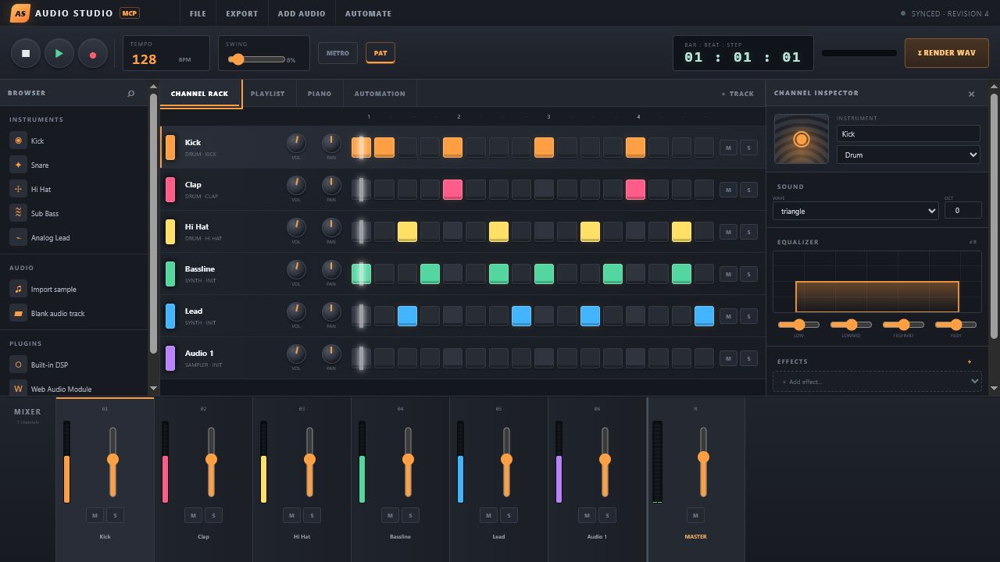

# MCP Audio Studio

An interactive digital audio workstation delivered as an MCP server and MCP App. It combines an FL-style channel rack, piano roll, playlist, mixer, effects, automation, plugin slots, audio-file tracks, microphone recording, and offline WAV rendering in one package.



The model and the person use the same authoritative project. Every UI action calls an MCP tool; every model-side edit becomes visible in an open studio through revision polling.

## What works

- Tempo, time signature, swing, metronome, loop, play/stop, and microphone record controls.
- Instrument and audio tracks with a 16-step channel rack and chromatic piano roll.
- Audio file import, clip placement, gain/trim metadata, and browser playback.
- Per-channel and master volume, pan, mute, solo, sends, and animated meters.
- Four-band equalizer and filter, delay, reverb, distortion, compressor, chorus, and limiter slots.
- Playback and render automation for master/track mixing, EQ, sends, built-in effects, instrument parameters, and numeric plugin parameters, with linear, hold, and smooth control points.
- Built-in DSP slots, browser-safe Web Audio Module (WAM) slots, and VST3 control/state slots.
- Pure-JavaScript stereo WAV rendering, returned as playable MCP audio content.
- Project persistence, import, and export.
- stdio, Streamable HTTP, and HTTPS transports.
- Standalone browser mode at the HTTP/HTTPS server root.

## Run it

### One standalone executable

Download the executable for Windows, macOS, or Linux from [GitHub Releases](https://github.com/flujo-app/mcp-audio-studio-mcpapp/releases). It contains the server, MCP App, runtime, and JavaScript dependencies.

```powershell
# MCP stdio
./mcp-audio-studio-windows-x64.exe --stdio

# HTTPS MCP endpoint + standalone studio
./mcp-audio-studio-windows-x64.exe --https --port 3100
```

Without configured certificates, HTTPS mode creates an ephemeral self-signed localhost certificate. For a trusted certificate, set `MCP_AUDIO_STUDIO_TLS_CERT` and `MCP_AUDIO_STUDIO_TLS_KEY`.

### Node package

Node.js 18+ is needed only when using the npm/package-source route:

```bash
npm install
npm run build
node ./dist/index.js --stdio
node ./dist/index.js --http --port 3100
```

The HTTP studio opens at `http://127.0.0.1:3100/`; the MCP endpoint is `http://127.0.0.1:3100/mcp`.

### MCP client configuration

For a checked-out repository:

```json
{
  "mcpServers": {
    "audio-studio": {
      "command": "node",
      "args": ["./dist/index.js", "--stdio"]
    }
  }
}
```

For a downloaded executable, replace `command` with its absolute path and use `["--stdio"]` for `args`.

Call `studio_ui` to render the studio. The tool declares `_meta.ui.resourceUri = "ui://audio-studio/studio-v1.html"`, and the resource uses the portable `text/html;profile=mcp-app` MIME type and MCP Apps bridge.

## MCP tools

| Area | Tools |
| --- | --- |
| Studio and project | `studio_ui`, `get_project`, `new_project`, `set_project`, `import_project`, `export_project` |
| Transport | `set_transport` |
| Tracks and notes | `add_track`, `update_track`, `remove_track`, `set_steps` |
| Audio clips | `add_audio_clip`, `update_audio_clip`, `remove_audio_clip` |
| Mixing | `set_mixer`, `set_equalizer` |
| Effects | `add_effect`, `update_effect`, `remove_effect` |
| Plugins | `add_plugin`, `update_plugin`, `remove_plugin` |
| Automation | `upsert_automation`, `remove_automation` |
| Rendering | `render_audio`, `get_render` |

All data tools work without a UI and return model-readable text plus structured content. `studio_ui` is the dedicated render tool, avoiding unnecessary iframe remounts.

## VST3 and WAM support

MCP Apps run in a sandboxed browser iframe, which cannot load native `.dll`, `.so`, or `.vst3` binaries. This release therefore provides:

- WAM URL slots for browser-safe plugin modules.
- VST3 slots with paths, enable/bypass, parameters, opaque state, and automation targets.
- A stable project/tool representation intended for a future native plugin-host bridge.

The bundled Web Audio and offline render engines process built-in instruments/effects. Native VST3 DSP is not executed in this release; representing it otherwise would be unsafe and technically inaccurate. A native bridge should isolate each plugin in its own process and use licensed VST3 hosting APIs.

## Persistence and audio files

Pass `--data ./studio-project.json` or set `MCP_AUDIO_STUDIO_DATA` to persist every revision. Imported audio is stored as a data URL inside the project. Browser imports and microphone recordings are normalized to PCM WAV so browser playback and offline rendering use the same asset; direct MCP imports should provide PCM/float WAV data. Offline rendering always emits 16-bit stereo WAV.

Recent renders are kept in memory (up to eight) and are accessible with `get_render` or, in web mode, `GET /renders/:id`.

## Development

```bash
npm ci
npm run typecheck
npm test
npm run build
npm run serve
```

`npm run build` produces a single `./dist/index.js` with the entire minified React MCP App embedded as a string. Tests use the official MCP SDK’s linked in-memory transport to verify tool and UI resource discovery.

### Publishing to npm

To publish the current version:

```bash
npm run release
```

The release command signs in through npm when necessary, runs the complete
check suite, publishes the package publicly, and confirms that npm serves the
version. It is safe to rerun: if that exact version is already published, it
verifies the project and skips the duplicate publish.

Run `npm run release:check` to validate the release helper without publishing.

## Security

- The web server disables identifying headers and uses a 64 MB JSON limit for embedded audio.
- MCP App permissions request microphone and clipboard-write; hosts may deny either capability.
- The app declares inline, fullscreen, and picture-in-picture (`pip`) display-mode support; the host chooses which declared modes are available.
- Remote WAM and audio URLs are represented in project state but are not allowed by the embedded MCP App CSP in this release.
- VST3 paths are metadata only and are never executed.

See [SECURITY.md](SECURITY.md) for reporting vulnerabilities.

## License

MIT
